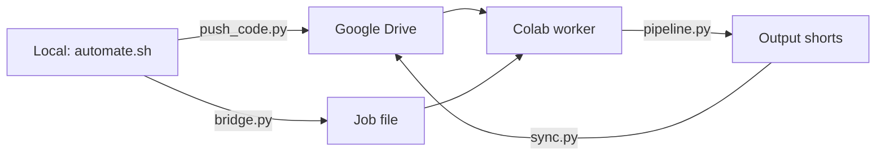

# Architecture

## Pipeline Phases

```
┌──────────────────────────────────────────────────────────────────┐
│  PHASE 1: DOWNLOAD                                              │
│  yt-dlp + aria2c → input/video.mp4                              │
│  --skip-download to reuse existing                              │
├──────────────────────────────────────────────────────────────────┤
│  PHASE 2: TRANSCRIBE                                            │
│  faster-whisper → transcripts/{video}.json                      │
│  Language: hi (Hinglish/Hindi)                                  │
│  Device: cuda on Colab, cpu on Mac                              │
├──────────────────────────────────────────────────────────────────┤
│  PHASE 3: HIGHLIGHT DETECTION                                   │
│  Audio RMS energy + transcript scoring → highlights/{video}.yaml│
│  Gemini AI refinement (optional)                                │
├──────────────────────────────────────────────────────────────────┤
│  PHASE 4: FRAME ANALYSIS + EXPORT                               │
│  ┌─ Cheap (default): ──────────────────────────────────────────┐│
│  │ Haar Cascade → EMA smooth → heuristic layout → FFmpeg crop ││
│  └─────────────────────────────────────────────────────────────┘│
│  ┌─ Premium (config toggle): ──────────────────────────────────┐│
│  │ YOLOv8-face → ByteTrack → Kalman+bezier → layout classifier││
│  │ → RIFE 30→60fps → GFPGAN enhance → two-pass VBR            ││
│  └─────────────────────────────────────────────────────────────┘│
├──────────────────────────────────────────────────────────────────┤
│  PHASE 4.5: SEO + THUMBNAILS                                    │
│  Gemini generates: title, description, hashtags, thumbnail       │
├──────────────────────────────────────────────────────────────────┤
│  PHASE 5: SYNC (optional)                                       │
│  Google Drive upload via Drive API                               │
├──────────────────────────────────────────────────────────────────┤
│  PHASE 6: UPLOAD (optional)                                     │
│  YouTube API → private/unlisted/public                           │
└──────────────────────────────────────────────────────────────────┘
```

## Key Design Decisions

### 1. Dual Pipeline Architecture
The codebase maintains TWO complete analysis paths:
- **Cheap path** (`frame_analyzer.py`): OpenCV Haar Cascade + heuristics. No GPU needed. Runs anywhere.
- **Premium path** (`premium_analyzer.py` + `premium_render.py`): YOLOv8-face + ByteTrack + Kalman + RIFE + GFPGAN. Requires GPU.

Selected via `premium.enabled` in config.yaml. `export.py` auto-detects which path to use at import time.

### 2. Pre-Generation Test Guard
Controlled by `testing.enabled` in config.yaml (default: `false` on Colab for speed).
When enabled, `pytest tests/ -x --timeout=120` runs before any expensive operation.
Use `--skip-tests` to bypass. Set `testing.enabled: true` for local development.

### 3. Colab Bridge Architecture


The bridge system:
1. `push_code.py` syncs code files to Google Drive
2. `bridge.py` writes a job file (youtube URL + flags)
3. `colab_setup.py` + `watcher.py` on Colab — sets up deps + tunnel, listens for pipeline jobs
4. Results sync back to Drive

### 4. ByteTrack Implementation
Custom lightweight ByteTrack (not the full boxmot library):
- KalmanBoxTracker: 7-dim state [x1,y1,x2,y2,vx,vy,vw], 4-dim measurement
- Two-stage matching: high-confidence detections first, low-confidence second
- Hungarian algorithm via scipy (fallback: greedy matching)
- Graceful degradation: falls back to Haar Cascade + EMA if filterpy/scipy missing

### 5. Speed Profile
Gaussian-smoothed per-frame speed multiplier (1.0-1.25x):
- Base: 1.0x (normal pace)
- Fast speech (>150 WPM): 1.15x
- High silence ratio (>30%): 1.25x
- Transitions: Gaussian kernel with sigma = 5% of clip duration

## GPU/CPU Split (Colab T4)

| Operation | Device | VRAM |
|---|---|---|
| YOLOv8-face inference | GPU | ~0.5 GB |
| ByteTrack matching | CPU | 0 |
| FILM/RIFE interpolation | GPU | ~3 GB |
| GFPGAN enhancement | GPU | ~2.5 GB |
| FFmpeg NVENC encode | GPU | ~0.5 GB |
| Whisper transcription | CPU (parallel) | 0 |
| Total peak | GPU | ~6.5 GB |

## Config Reference

```yaml
paths:           # All I/O directories
download:        # yt-dlp + aria2c params
transcription:   # faster-whisper model/device/language
highlight:       # scoring thresholds, clip sizes
premium:         # premium toggle + feature flags
layout:          # facecam position, chat overlay config
export:          # resolution, fps, bitrate, encoder, transitions
youtube:         # upload privacy, scheduling, category
ai:              # LLM provider (gemini/openai)
thumbnail:       # AI thumbnail generation
quality:         # black detection, silence, frame sampling
testing:         # pre-generation test guard config
logging:         # level, log file path
```

## Test Suite Structure (219+ tests)

```
tests/
├── conftest.py              # 7 synthetic 16:9 fixtures + parametrized any_video
├── test_analyzer.py         # Cheap analyzer smoke tests (5)
├── test_analytics_tdd.py    # Analytics/SEO feedback loop tests (5)
├── test_bugs_corrected.py   # TDD bug regression tests (22)
├── test_clipping_quality.py # Clipping regression tests (10)
├── test_cricbuzz_integration.py  # Cricbuzz API tests (7)
├── test_export.py           # Export pipeline tests (15)
├── test_features_tdd.py     # Feature regression tests (5)
├── test_flow.py             # Integration flow tests (3)
├── test_frame_analyzer.py   # Frame analyzer unit tests (17)
├── test_full_scan_and_layout.py  # Full scan tests (5)
├── test_seo.py              # SEO generation tests (16)
├── test_premium_analyzer.py # Premium analyzer unit tests (20)
├── test_premium_render.py   # Premium render unit tests (9)
├── test_synthetic_quality.py # Synthetic image/video quality tests (14)
├── test_integration.py      # End-to-end integration tests (14)
├── test_tdd_regression.py   # Regression guard tests (9)
└── test_fuzz.py             # Fuzz testing — random inputs (20)
```

## Dependencies

### Core
- Python 3.11+
- faster-whisper, yt-dlp, opencv-python-headless, numpy
- rich (logging), PyYAML, Pillow
- google-api-python-client (Drive/YouTube)

### Testing
- pytest, pytest-timeout, pytest-mock

### Premium (Colab T4)
- ultralytics (YOLOv8-face), torch
- filterpy (Kalman filter), scipy (Hungarian matching)
- gfpgan, basicsr (face enhancement)
