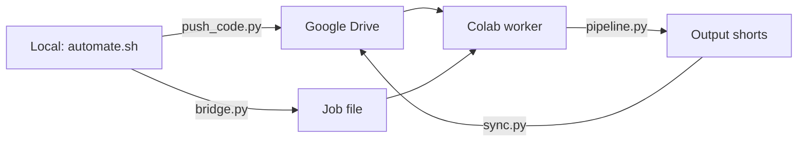

# Architecture

## Pipeline Phases

```
┌──────────────────────────────────────────────────────────────────┐
│  PHASE 1: DOWNLOAD                                              │
│  yt-dlp + aria2c → input/video.mp4                              │
│  --skip-download to reuse existing                              │
├──────────────────────────────────────────────────────────────────┤
│  PHASE 2: TRANSCRIBE                                            │
│  faster-whisper → transcripts/{video}.json                      │
│  Language: hi (Hinglish/Hindi)                                  │
│  Device: cuda on Colab, cpu on Mac                              │
├──────────────────────────────────────────────────────────────────┤
│  PHASE 2.5: VIDEO ANALYSIS                                      │
│  video_analyzer.py — face/lighting map for full VOD             │
│  Samples every 2s, builds quality map for highlight selection   │
├──────────────────────────────────────────────────────────────────┤
│  PHASE 3: HIGHLIGHT DETECTION                                   │
│  Audio RMS energy + transcript scoring → highlights/{video}.yaml│
│  Gemini AI refinement (optional)                                │
├──────────────────────────────────────────────────────────────────┤
│  PHASE 4: FRAME ANALYSIS + EXPORT                               │
│  16:9 → 9:16 smart crop + encode                                │
│  ┌─ Cheap (default): ──────────────────────────────────────────┐│
│  │ Haar Cascade → EMA smooth → heuristic layout → FFmpeg crop ││
│  └─────────────────────────────────────────────────────────────┘│
│  ┌─ Premium (config toggle): ──────────────────────────────────┐│
│  │ YOLOv8-face → ByteTrack → Kalman+bezier → layout classifier││
│  │ → RIFE 30→60fps → GFPGAN enhance → two-pass VBR            ││
│  └─────────────────────────────────────────────────────────────┘│
├──────────────────────────────────────────────────────────────────┤
│  PHASE 4.25: SELECTIVE ENHANCEMENT (config toggle)              │
│  3-pass enhancement on 9:16 cropped output from Phase 4         │
│  ┌─ Pass 1: state_analyzer.py ─────────────────────────────────┐│
│  │ Per-frame state classification: heavy/light/skip             ││
│  │ Based on mouth, eyes, pose, lighting, sharpness              ││
│  ├─ Pass 2: selective_enhancer.py ─────────────────────────────┤│
│  │ heavy: GFPGAN face restore + sharpen                        ││
│  │ light: conservative sharpen + color                         ││
│  │ skip:  temporal propagation from nearest enhanced            ││
│  ├─ Pass 3: temporal_consistency.py ───────────────────────────┤│
│  │ IIR face smoothing, drift correction, boundary blend        ││
│  └─────────────────────────────────────────────────────────────┘│
│  Input:  export.py output (9:16 cropped video)                  │
│  Output: enhanced 9:16 video (replaces export output)           │
│  Toggle: enhancement.selective in config.yaml                   │
├──────────────────────────────────────────────────────────────────┤
│  PHASE 4.5: SEO + THUMBNAILS                                    │
│  Model chain: MinMax → Groq → NVIDIA (quality-gated)            │
│  LLM generates: title, description, hashtags, tags, search      │
│  terms. Quality validator ensures pipe format, sections, tags.  │
│  Falls back to template if all models fail.                     │
│  seo_learner tracks performance → self-improving prompts.       │
├──────────────────────────────────────────────────────────────────┤
│  PHASE 5: SYNC (optional)                                       │
│  Google Drive upload via Drive API                               │
├──────────────────────────────────────────────────────────────────┤
│  PHASE 6: UPLOAD (optional)                                     │
│  YouTube API → private/unlisted/public                           │
└──────────────────────────────────────────────────────────────────┘
```

## Key Design Decisions

### 1. Dual Pipeline Architecture
The codebase maintains TWO complete analysis paths:
- **Cheap path** (`frame_analyzer.py`): OpenCV Haar Cascade + heuristics. No GPU needed. Runs anywhere.
- **Premium path** (`premium_analyzer.py` + `premium_render.py`): YOLOv8-face + ByteTrack + Kalman + RIFE + GFPGAN. Requires GPU.

Selected via `premium.enabled` in config.yaml. `export.py` auto-detects which path to use at import time.

### 2. Selective Enhancement Pipeline (Phase 4.25)

When `enhancement.selective: true` in config.yaml, a 3-pass enhancement runs on each exported 9:16 clip:

```
export.py output (9:16)
    │
    ├─ Pass 1: state_analyzer.py
    │   Per-frame classification → heavy/light/skip
    │   Factors: mouth state, eye state, pose, lighting, sharpness, artifacts
    │   Output: analysis JSON with per-frame enhancement map
    │
    ├─ Pass 2: selective_enhancer.py
    │   heavy frames → GFPGAN face restore + sharpen
    │   light frames → conservative sharpen + color boost
    │   skip frames → propagate from nearest enhanced frame
    │   Background → global grade (brightness/contrast/color temp)
    │
    └─ Pass 3: temporal_consistency.py
        IIR face smoothing (alpha=0.7) → no flicker between frames
        Global frame smoothing (alpha=0.85) → no background flicker
        Drift detection → re-sync if face identity changes
        Segment boundary blending → smooth transitions
```

**Critical: This operates on 9:16 cropped video, NOT raw 16:9 source.**

When selective enhancement is ON, the FFmpeg filters in `export.py` are disabled to prevent double processing.

### 3. Pre-Generation Test Guard
Controlled by `testing.enabled` in config.yaml (default: `false` on Colab for speed).
When enabled, `pytest tests/ -x --timeout=120` runs before any expensive operation.
Use `--skip-tests` to bypass. Set `testing.enabled: true` for local development.

### 3. Colab Bridge Architecture


The bridge system:
1. `push_code.py` syncs code files to Google Drive
2. `bridge.py` writes a job file (youtube URL + flags)
3. `colab_setup.py` + `watcher.py` on Colab — sets up deps + tunnel, listens for pipeline jobs
4. Results sync back to Drive

### 4. ByteTrack Implementation
Custom lightweight ByteTrack (not the full boxmot library):
- KalmanBoxTracker: 7-dim state [x1,y1,x2,y2,vx,vy,vw], 4-dim measurement
- Two-stage matching: high-confidence detections first, low-confidence second
- Hungarian algorithm via scipy (fallback: greedy matching)
- Graceful degradation: falls back to Haar Cascade + EMA if filterpy/scipy missing

### 5. SEO Generation Architecture

Three-tier fallback with quality validation:

```
generate_clip_seo(clip_id, transcript, ...)
  │
  ├─ #1: _try_model_chain()
  │   ├─ MinMax-m2.5 (OpenRouter, free) — best quality, 25+ tags/terms
  │   ├─ llama-3.3-70b (Groq, free, fast) — reliable fallback
  │   └─ llama-3.3-70b (NVIDIA) — last resort
  │   └─ Each output validated by validate_seo_quality():
  │       ✓ Title has "| Team vs Team | Tournament" pipe format
  │       ✓ Description has 3+ of 4 required sections
  │       ✓ 10+ SEO tags, 10+ search terms
  │       ✓ Includes #Shorts hashtag
  │       ✓ No generic patterns ("cricket live:", etc.)
  │
  ├─ #2: Direct AI call (configured provider, retry loop with backoff)
  │   └─ Also quality-validated
  │
  └─ #3: Template fallback (_generate_template_seo)
      └─ ai_generated=False → upload skips these clips
```

**Self-improving loop** (seo_learner.py):
- After upload, `learn_from_clip_performance()` records views/likes/CTR
- Tracks patterns: pipe_format, power_word, player_name, sections, tags count
- `enhance_seo_prompt()` appends learned insights to next prompt:
  ```
  ✅ What WORKS: pipe_format:true_power_word:true (avg score: 0.85)
  ❌ What to AVOID: pipe_format:false (avg score: 0.32)
  💡 Recommendation: Always add | Team vs Team | Tournament
  ```

### 6. Speed Profile
Gaussian-smoothed per-frame speed multiplier (1.0-1.25x):
- Base: 1.0x (normal pace)
- Fast speech (>150 WPM): 1.15x
- High silence ratio (>30%): 1.25x
- Transitions: Gaussian kernel with sigma = 5% of clip duration

## GPU/CPU Split (Colab T4)

| Operation | Device | VRAM |
|---|---|---|
| YOLOv8-face inference | GPU | ~0.5 GB |
| ByteTrack matching | CPU | 0 |
| FILM/RIFE interpolation | GPU | ~3 GB |
| GFPGAN enhancement | GPU | ~2.5 GB |
| Real-ESRGAN 4x upscale | GPU | ~3 GB |
| FFmpeg NVENC encode | GPU | ~0.5 GB |
| Whisper transcription | CPU (parallel) | 0 |
| State analysis (Pass 1) | CPU | 0 |
| Selective enhancement (Pass 2) | GPU (GFPGAN) | ~2.5 GB |
| Temporal consistency (Pass 3) | CPU | 0 |
| Peak total (with selective) | GPU | ~8.5 GB |

## Config Reference

```yaml
paths:           # All I/O directories
download:        # yt-dlp + aria2c params
transcription:   # faster-whisper model/device/language
highlight:       # scoring thresholds, clip sizes
premium:         # premium toggle + feature flags
layout:          # facecam position, chat overlay config
export:          # resolution, fps, bitrate, encoder, transitions
enhancement:     # 3-pass selective enhancement (Phase 4.25)
youtube:         # upload privacy, scheduling, category
ai:              # LLM provider (groq/nvidia/openrouter)
thumbnail:       # AI thumbnail generation
quality:         # black detection, silence, frame sampling
testing:         # pre-generation test guard config
logging:         # level, log file path
```

## Test Suite Structure (219+ tests)

```
tests/
├── conftest.py              # 7 synthetic 16:9 fixtures + parametrized any_video
├── test_analyzer.py         # Cheap analyzer smoke tests (5)
├── test_analytics_tdd.py    # Analytics/SEO feedback loop tests (5)
├── test_bugs_corrected.py   # TDD bug regression tests (22)
├── test_clipping_quality.py # Clipping regression tests (10)
├── test_cricbuzz_integration.py  # Cricbuzz API tests (7)
├── test_export.py           # Export pipeline tests (15)
├── test_features_tdd.py     # Feature regression tests (5)
├── test_flow.py             # Integration flow tests (3)
├── test_frame_analyzer.py   # Frame analyzer unit tests (17)
├── test_full_scan_and_layout.py  # Full scan tests (5)
├── test_seo.py              # SEO generation tests (50+): unit, quality validation,
│                           # model fallback chain, AI failure threshold, upload guard
├── test_premium_analyzer.py # Premium analyzer unit tests (20)
├── test_premium_render.py   # Premium render unit tests (9)
├── test_synthetic_quality.py # Synthetic image/video quality tests (14)
├── test_integration.py      # End-to-end integration tests (14)
├── test_tdd_regression.py   # Regression guard tests (9)
├── test_fuzz.py             # Fuzz testing — random inputs (20)
├── test_state_analyzer.py   # State analyzer integration tests (standalone)
└── test_full_pipeline.py    # 3-pass enhancement end-to-end test (standalone)
```

## Dependencies

### Core
- Python 3.11+
- faster-whisper, yt-dlp, opencv-python-headless, numpy
- rich (logging), PyYAML, Pillow
- google-api-python-client (Drive/YouTube)
- openai (OpenRouter, Groq, NVIDIA providers)

### Testing
- pytest, pytest-timeout, pytest-mock

### Premium (Colab T4)
- ultralytics (YOLOv8-face), torch
- filterpy (Kalman filter), scipy (Hungarian matching)
- gfpgan, basicsr (face enhancement)
- realesrgan (super-resolution)
